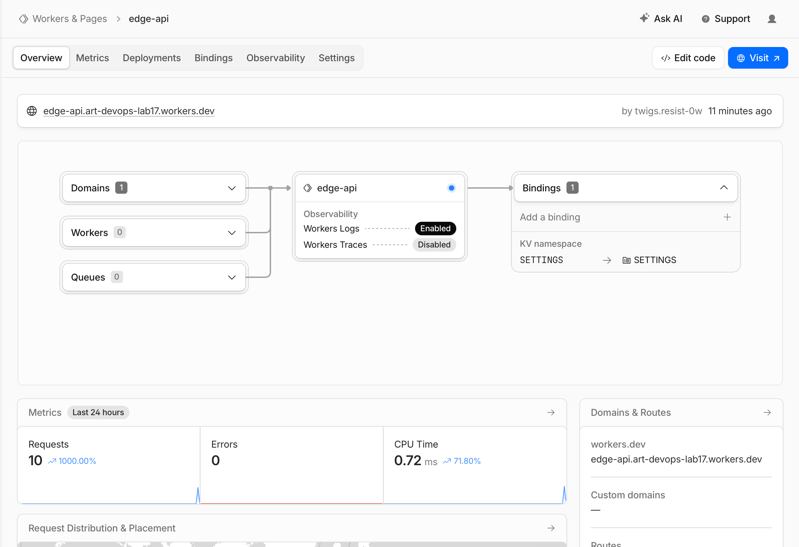
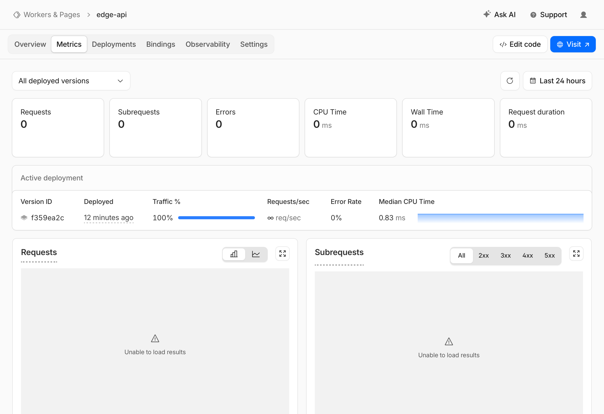
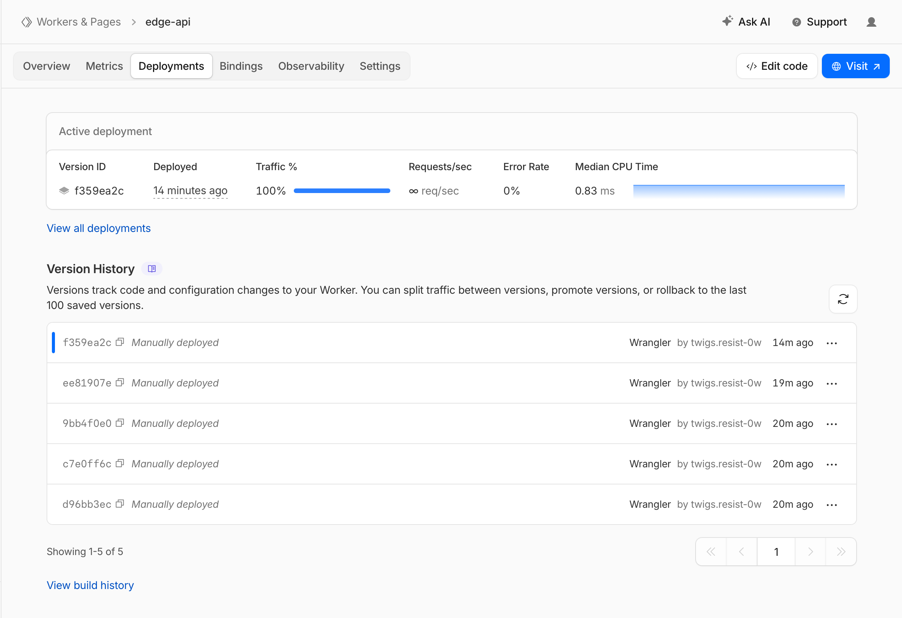

# Lab 17 — Cloudflare Workers Edge Deployment

## 1. Deployment Summary

This lab implements and deploys a serverless HTTP API on Cloudflare Workers.

Cloudflare Workers is an edge/serverless platform. Unlike Kubernetes, it does not require managing nodes, pods, clusters, deployments, or container images. The application runs on Cloudflare's global edge runtime and is exposed through a public `workers.dev` URL.

Public Worker URL:

```text
https://edge-api.art-devops-lab17.workers.dev
```

## 2. Worker Project

The Worker project was created using C3 (`create-cloudflare`) with the required settings:

- Project name: `edge-api`
- Template: Hello World example
- Type: Worker only
- Language: TypeScript
- Deploy now: No during project creation

Project structure:

```text
edge-api/
├── src/index.ts
├── wrangler.jsonc
├── package.json
├── tsconfig.json
└── screenshots/lab17/
```

Important files:

- `src/index.ts` — Worker API implementation
- `wrangler.jsonc` — Wrangler configuration, variables, observability, and KV binding
- `package.json` — dependencies and scripts

## 3. Wrangler Authentication

Wrangler authentication was completed using:

```bash
npx wrangler login
npx wrangler whoami
```

Evidence from `whoami`:

```text
You are logged in with an OAuth Token, associated with the email twigs.resist-0w@icloud.com.

Account Name:
Twigs.resist-0w@icloud.com's Account
```

This confirms that Wrangler was authenticated and connected to the Cloudflare account.

## 4. Worker Configuration

The Worker configuration is stored in `wrangler.jsonc`.

Key configuration:

```jsonc
{
  "name": "edge-api",
  "main": "src/index.ts",
  "compatibility_date": "2026-05-04",
  "observability": {
    "enabled": true
  },
  "upload_source_maps": true,
  "compatibility_flags": [
    "nodejs_compat"
  ],
  "vars": {
    "APP_NAME": "edge-api",
    "COURSE_NAME": "devops-core"
  },
  "kv_namespaces": [
    {
      "binding": "SETTINGS",
      "id": "e115e389c9f94bbc9d83a2383eb7c632"
    }
  ]
}
```

Plaintext variables configured:

- `APP_NAME=edge-api`
- `COURSE_NAME=devops-core`

Plaintext variables are useful for non-sensitive configuration, but they are not suitable for secrets because they are committed into source control.

## 5. Implemented Routes

The Worker implements the following HTTP endpoints:

| Route | Purpose |
|---|---|
| `/` | General app information and list of available routes |
| `/health` | Health check endpoint |
| `/edge` | Cloudflare edge metadata endpoint |
| `/config` | Configuration/secrets/KV availability check |
| `/counter` | KV-backed persistent counter |
| other paths | Returns `404 Not Found` JSON response |

## 6. Local Development Test

Local development was started with:

```bash
npx wrangler dev
```

Local URL:

```text
http://localhost:8787
```

Local endpoint tests:

```bash
curl http://localhost:8787/
curl http://localhost:8787/health
curl http://localhost:8787/edge
curl http://localhost:8787/config
curl http://localhost:8787/not-found
```

Local output:

```text
{"app":"edge-api","course":"devops-core","message":"Hello from Cloudflare Workers","timestamp":"2026-05-04T04:09:02.422Z","routes":["/","/health","/edge","/config","/counter"]}
{"status":"ok","service":"edge-api","timestamp":"2026-05-04T04:09:02.438Z"}
{"colo":"SIN","country":"SG","city":"Singapore","asn":395092,"httpProtocol":"HTTP/1.1","tlsVersion":"TLSv1.3"}
{"appName":"edge-api","courseName":"devops-core","hasApiToken":false,"hasAdminEmail":false,"hasKV":false}
{"error":"Not Found","path":"/not-found"}
```

This verifies that the local Worker API returns correct JSON responses and status behavior.

## 7. Public Deployment

The Worker was deployed with:

```bash
npx wrangler deploy
```

Deployment output:

```text
Uploaded edge-api
Deployed edge-api triggers
  https://edge-api.art-devops-lab17.workers.dev
Current Version ID: ee81907e-8172-44a0-ad17-26ae674f6e27
```

## 8. Public Endpoint Verification

Public endpoints were tested with:

```bash
curl https://edge-api.art-devops-lab17.workers.dev/
curl https://edge-api.art-devops-lab17.workers.dev/health
curl https://edge-api.art-devops-lab17.workers.dev/edge
curl https://edge-api.art-devops-lab17.workers.dev/config
curl https://edge-api.art-devops-lab17.workers.dev/counter
curl https://edge-api.art-devops-lab17.workers.dev/counter
```

Output:

```text
{"app":"edge-api","course":"devops-core","message":"Hello from Cloudflare Workers","timestamp":"2026-05-04T04:19:40.481Z","routes":["/","/health","/edge","/config","/counter"]}
{"status":"ok","service":"edge-api","timestamp":"2026-05-04T04:19:40.729Z"}
{"colo":"SIN","country":"SG","city":"Singapore","asn":395092,"httpProtocol":"HTTP/2","tlsVersion":"TLSv1.3"}
{"appName":"edge-api","courseName":"devops-core","hasApiToken":true,"hasAdminEmail":true,"hasKV":true}
{"visits":1,"persisted":true}
{"visits":2,"persisted":true}
```

This proves:

- the deployed Worker is publicly accessible
- `/health` works
- `/edge` returns Cloudflare edge metadata
- secrets are available in production
- KV binding is available
- `/counter` persists state through KV

## 9. Edge Metadata

The `/edge` endpoint returns Cloudflare request metadata from `request.cf`.

Observed public response:

```json
{
  "colo": "SIN",
  "country": "SG",
  "city": "Singapore",
  "asn": 395092,
  "httpProtocol": "HTTP/2",
  "tlsVersion": "TLSv1.3"
}
```

This demonstrates that the Worker executed through Cloudflare's edge network and that Cloudflare provided request metadata such as colo, country, city, ASN, HTTP protocol, and TLS version.

## 10. Global Edge Distribution

Cloudflare Workers are globally distributed by default. There is no manual step such as "deploy to 3 regions" because Workers run on Cloudflare's global network automatically.

In VM or PaaS platforms, the developer often chooses regions manually, such as Singapore, Amsterdam, or Virginia. With Workers, Cloudflare routes requests to a nearby edge location automatically.

This is why this lab focuses on inspecting metadata like `colo` and `country` instead of manually adding regions.

## 11. Routing Concepts

### workers.dev

`workers.dev` provides a quick public URL for a Worker without needing a custom domain.

This lab uses:

```text
https://edge-api.art-devops-lab17.workers.dev
```

### Routes

Routes attach a Worker to traffic for a domain already managed by Cloudflare. For example, a Worker can handle only a path such as:

```text
example.com/api/*
```

### Custom Domains

Custom domains allow the Worker to be served from a custom hostname or subdomain instead of `workers.dev`.

In this lab, `workers.dev` was sufficient and required.

## 12. Secrets

Two secrets were created with Wrangler:

```bash
printf "demo-token-lab17" | npx wrangler secret put API_TOKEN
printf "student@example.com" | npx wrangler secret put ADMIN_EMAIL
```

Secret list:

```text
[
  {
    "name": "ADMIN_EMAIL",
    "type": "secret_text"
  },
  {
    "name": "API_TOKEN",
    "type": "secret_text"
  }
]
```

The deployed `/config` endpoint confirmed that both secrets were available:

```json
{
  "hasApiToken": true,
  "hasAdminEmail": true,
  "hasKV": true
}
```

Secret values are not committed into Git. Only secret names are visible through Wrangler.

## 13. KV Persistence

A Workers KV namespace was created:

```bash
npx wrangler kv namespace create SETTINGS
```

KV namespace binding:

```json
{
  "binding": "SETTINGS",
  "id": "e115e389c9f94bbc9d83a2383eb7c632"
}
```

The `/counter` endpoint stores and increments the `visits` key in KV.

Initial public test:

```text
{"visits":1,"persisted":true}
{"visits":2,"persisted":true}
```

After redeploy:

```bash
npx wrangler deploy
curl https://edge-api.art-devops-lab17.workers.dev/counter
```

Output:

```text
{"visits":3,"persisted":true}
```

This proves that state stored in KV persists across redeployments.

## 14. Observability and Logs

A `console.log()` statement was added to the Worker:

```ts
console.log("request", {
  path: url.pathname,
  colo: request.cf?.colo,
  country: request.cf?.country,
});
```

Logs were viewed using:

```bash
npx wrangler tail
```

Example log entry:

```text
GET https://edge-api.art-devops-lab17.workers.dev/edge - Ok @ 5/4/2026, 11:22:02 AM
  (log) request { path: '/edge', colo: 'SIN', country: 'SG' }
```

This confirms production request logs are available.

## 15. Deployment History

Deployments were listed with:

```bash
npx wrangler deployments list
```

Observed deployment history:

```text
Created:     2026-05-04T04:14:17.850Z
Source:      Upload
Version(s):  (100%) d96bb3ec-0d53-4010-b0ae-d1c7952b2afa

Created:     2026-05-04T04:15:52.107Z
Source:      Unknown (deployment)
Version(s):  (100%) ee81907e-8172-44a0-ad17-26ae674f6e27

Created:     2026-05-04T04:20:37.409Z
Source:      Unknown (deployment)
Version(s):  (100%) f359ea2c-22e9-4419-a512-ab1cacec65bf
```

This proves that multiple deployments were created and can be inspected.

Rollback can be performed with:

```bash
npx wrangler rollback
```

In this lab, rollback behavior was documented through the deployment history and Cloudflare dashboard. Since the latest deployment was healthy, no rollback was required.

## 16. Dashboard Evidence

### Worker Dashboard

Screenshot:

```text
screenshots/lab17/01-dashboard.png
```



### Metrics

Screenshot:

```text
screenshots/lab17/02-metrics.png
```



### Deployments

Screenshot:

```text
screenshots/lab17/03-deployments.png
```



## 17. Kubernetes vs Cloudflare Workers Comparison

| Aspect | Kubernetes | Cloudflare Workers |
|---|---|---|
| Setup complexity | High: requires cluster, manifests, services, networking, storage, monitoring | Low: create project, configure Wrangler, deploy |
| Deployment speed | Slower: image build, push, rollout, cluster reconciliation | Very fast: source upload and edge deployment |
| Global distribution | Requires multiple clusters or multi-region infrastructure | Global by default on Cloudflare's edge network |
| Cost for small apps | Can be expensive or complex due to cluster overhead | Usually cheaper and simpler for small APIs |
| State/persistence model | PVCs, databases, StatefulSets, external storage | KV, Durable Objects, D1, R2 bindings |
| Control/flexibility | Very high: any container/runtime, networking, storage, operators | More constrained: Workers runtime, no arbitrary Docker container |
| Best use case | Complex services, long-running apps, custom infrastructure, stateful systems | Lightweight APIs, edge logic, request routing, global low-latency apps |

## 18. When to Use Each

### Use Kubernetes when:

- the application requires custom containers
- workloads are long-running
- the system needs complex networking
- the app needs StatefulSets, persistent volumes, or operators
- the team needs full infrastructure control
- many internal services must communicate inside a cluster

### Use Cloudflare Workers when:

- the application is a lightweight HTTP API
- global low latency is important
- deployment speed matters
- operational overhead should be minimal
- the app benefits from edge metadata and request routing
- state can be stored in platform services such as KV, D1, R2, or Durable Objects

## 19. Reflection

Cloudflare Workers felt easier than Kubernetes because there was no need to manage clusters, nodes, pods, services, ingresses, or container images. Deployment was much faster and the public URL was created automatically through `workers.dev`.

Workers felt more constrained because it is not a Docker host. The application must be written for the Workers runtime, and state must be stored through platform bindings such as KV rather than through local files or persistent volumes.

The biggest difference is that Workers are globally distributed by default. In Kubernetes, global distribution usually requires additional clusters, load balancers, DNS, and operational planning. In Workers, Cloudflare handles global routing automatically.

## 20. Final Result

By the end of this lab, the following were completed:

- Cloudflare Workers project created with TypeScript
- Wrangler authenticated successfully
- Worker deployed to public `workers.dev` URL
- `/`, `/health`, `/edge`, `/config`, and `/counter` endpoints implemented
- edge metadata verified with `colo`, `country`, `city`, `asn`, `httpProtocol`, and `tlsVersion`
- plaintext vars configured
- two secrets configured
- KV namespace created and bound
- KV persistence verified after redeployment
- production logs viewed with `wrangler tail`
- deployment history viewed
- Cloudflare dashboard, metrics, and deployment screenshots captured
- Kubernetes vs Workers comparison documented

Public URL:

```text
https://edge-api.art-devops-lab17.workers.dev
```
