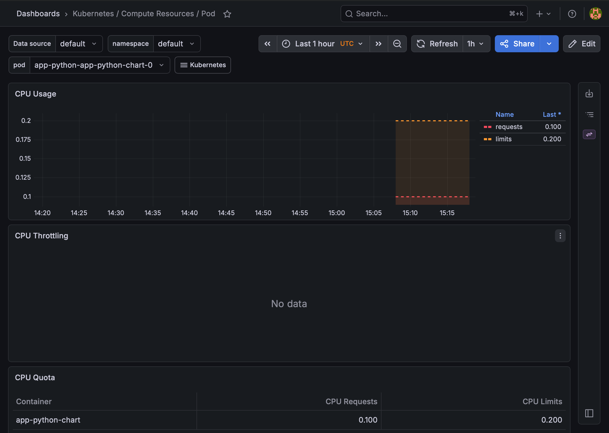
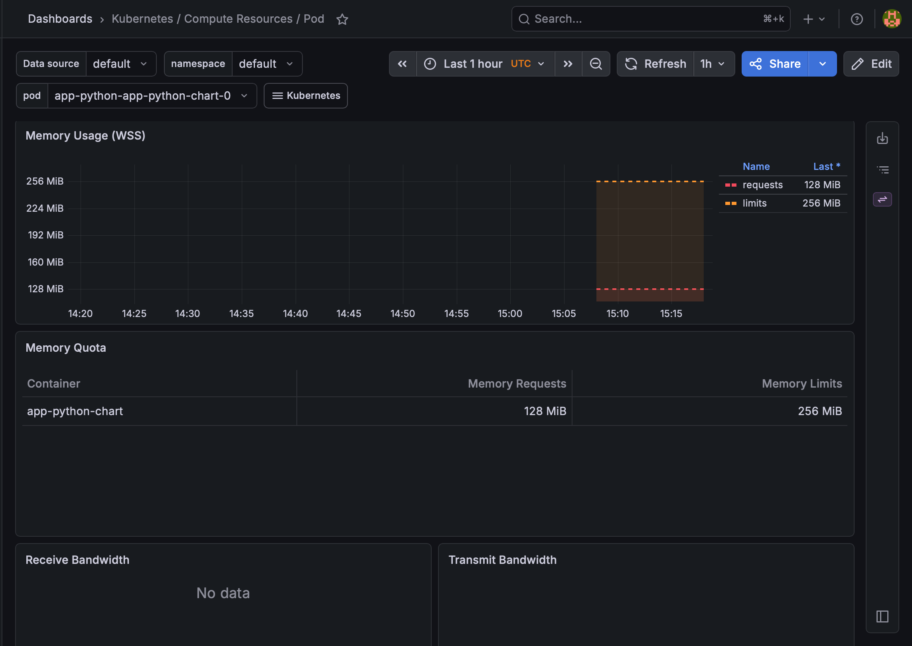
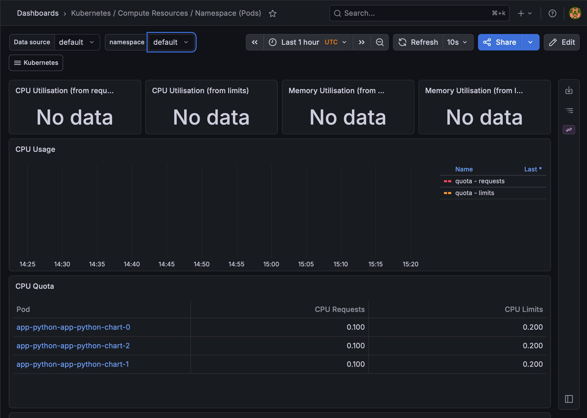
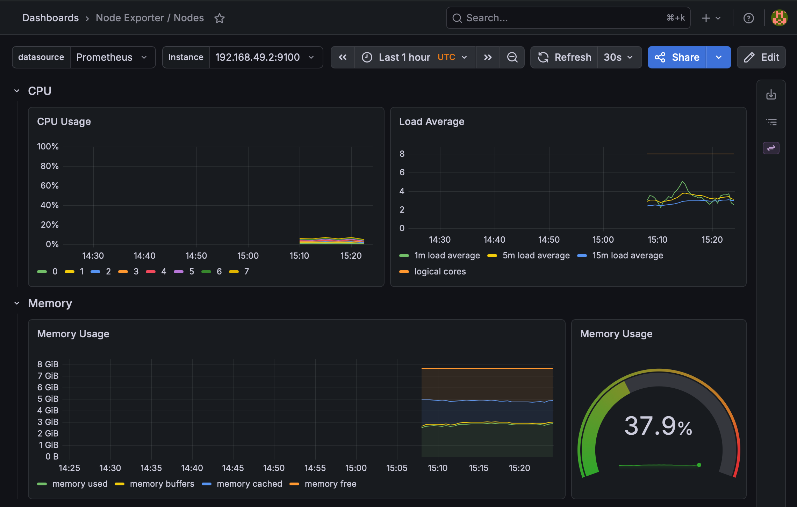
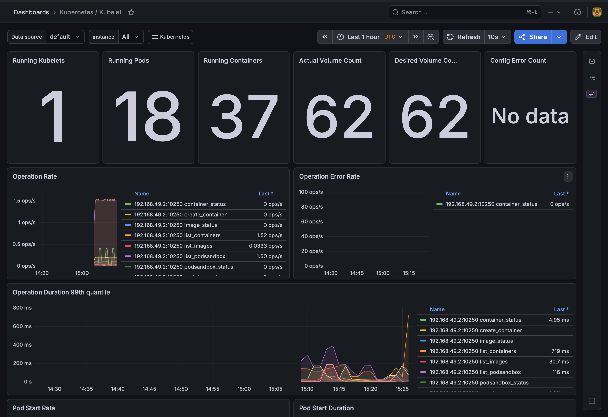
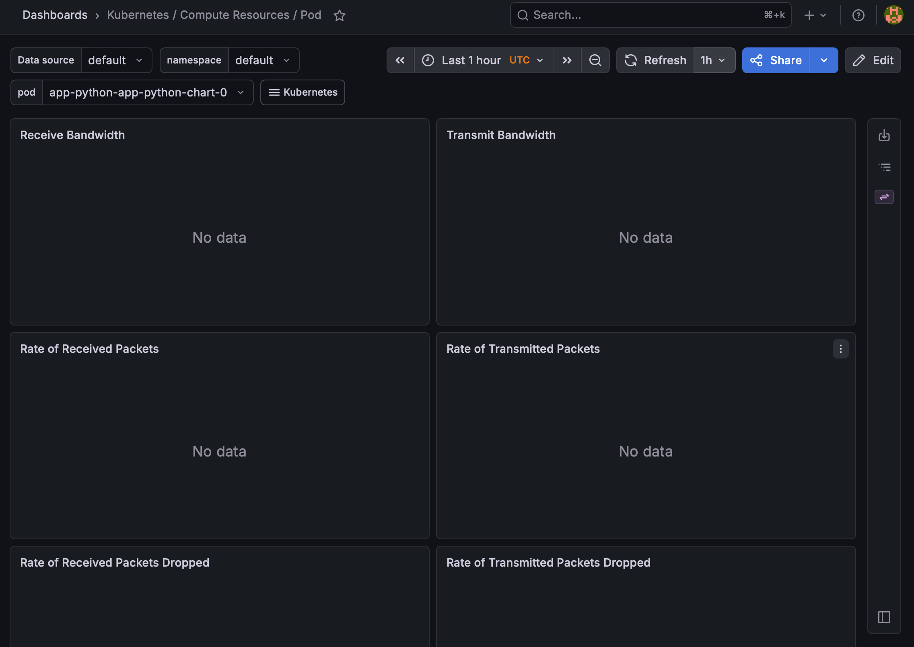
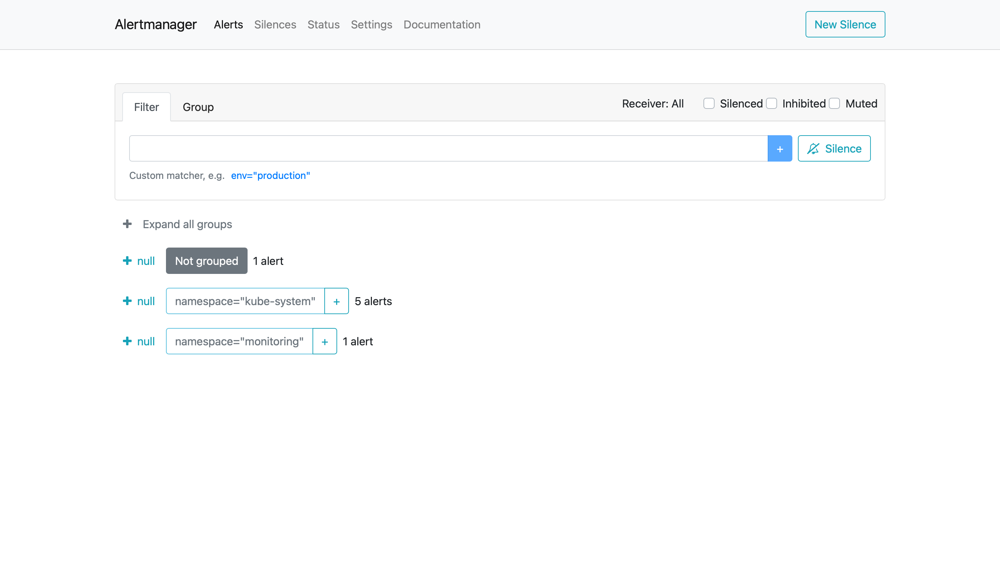

# Lab 16 — Kubernetes Monitoring & Init Containers

## 1. Objective

This lab implements Kubernetes observability with the Kube-Prometheus stack and demonstrates init container patterns.

The lab covers:

- Prometheus stack installation
- Grafana dashboard exploration
- Alertmanager access
- init container for initialization
- wait-for-service init container pattern

---

## 2. Monitoring Stack Components

### Prometheus Operator

Prometheus Operator manages Prometheus, Alertmanager, and related monitoring resources through Kubernetes custom resources. Instead of manually configuring Prometheus, the operator watches Kubernetes resources and reconciles the monitoring stack automatically.

### Prometheus

Prometheus collects and stores time-series metrics from Kubernetes components and application endpoints. It is used for querying metrics such as CPU usage, memory usage, network traffic, pod status, and node metrics.

### Alertmanager

Alertmanager receives alerts from Prometheus and manages alert grouping, deduplication, silencing, and routing. It is responsible for showing active alerts and sending notifications in real production setups.

### Grafana

Grafana provides dashboards and visualizations for Prometheus metrics. In this lab, Grafana was used to inspect pod resources, namespace metrics, node metrics, kubelet metrics, network traffic, and alerts.

### kube-state-metrics

kube-state-metrics exposes Kubernetes object state as metrics. It provides information about Deployments, StatefulSets, pods, PVCs, services, and other Kubernetes resources.

### node-exporter

node-exporter exposes host-level metrics from Kubernetes nodes. It provides information such as CPU, memory, disk, filesystem, and network usage for the node.

---

## 3. Installation

The Prometheus community Helm repository was added:

```bash
helm repo add prometheus-community https://prometheus-community.github.io/helm-charts
helm repo update
```

The kube-prometheus-stack chart was installed in the `monitoring` namespace:

```bash
helm install monitoring prometheus-community/kube-prometheus-stack \
  --namespace monitoring \
  --create-namespace
```

---

## 4. Installation Evidence

Command:

```bash
kubectl get po,svc -n monitoring
```

Output:

```text
NAME                                                         READY   STATUS    RESTARTS   AGE
pod/alertmanager-monitoring-kube-prometheus-alertmanager-0   2/2     Running   0          46m
pod/monitoring-grafana-ccdc69c7c-4skgb                       3/3     Running   0          48m
pod/monitoring-kube-prometheus-operator-54f68d65b4-tq9bp     1/1     Running   0          48m
pod/monitoring-kube-state-metrics-5957bd45bc-lfqr2           1/1     Running   0          48m
pod/monitoring-prometheus-node-exporter-s7jb4                1/1     Running   0          48m
pod/prometheus-monitoring-kube-prometheus-prometheus-0       2/2     Running   0          46m

NAME                                              TYPE        CLUSTER-IP      EXTERNAL-IP   PORT(S)                      AGE
service/alertmanager-operated                     ClusterIP   None            <none>        9093/TCP,9094/TCP,9094/UDP   46m
service/monitoring-grafana                        ClusterIP   10.106.161.12   <none>        80/TCP                       48m
service/monitoring-kube-prometheus-alertmanager   ClusterIP   10.110.245.86   <none>        9093/TCP,8080/TCP            48m
service/monitoring-kube-prometheus-operator       ClusterIP   10.109.68.23    <none>        443/TCP                      48m
service/monitoring-kube-prometheus-prometheus     ClusterIP   10.109.79.196   <none>        9090/TCP,8080/TCP            48m
service/monitoring-kube-state-metrics             ClusterIP   10.98.184.82    <none>        8080/TCP                     48m
service/monitoring-prometheus-node-exporter       ClusterIP   10.98.241.61    <none>        9100/TCP                     48m
service/prometheus-operated                       ClusterIP   None            <none>        9090/TCP                     46m
```

This confirms that all major monitoring components were installed and running.

---

## 5. Grafana Access

Grafana was accessed through port-forwarding:

```bash
kubectl port-forward svc/monitoring-grafana -n monitoring 3000:80
```

Grafana URL:

```text
http://localhost:3000
```

The real admin password was retrieved from the Kubernetes secret:

```bash
kubectl get secret monitoring-grafana -n monitoring -o jsonpath="{.data.admin-password}" | base64 -d ; echo
```

---

## 6. Dashboard Exploration

### 6.1 Pod CPU Usage

Dashboard used:

```text
Kubernetes / Compute Resources / Pod
```

Namespace:

```text
default
```

Pod selected:

```text
app-python-app-python-chart-*
```

Evidence screenshot:

```text
screenshots/lab16/01-pod-cpu.png
```



### 6.2 Pod Memory Usage

Dashboard used:

```text
Kubernetes / Compute Resources / Pod
```

Evidence screenshot:

```text
screenshots/lab16/01-pod-memory.png
```



### 6.3 Namespace CPU Analysis

Dashboard used:

```text
Kubernetes / Compute Resources / Namespace (Pods)
```

Namespace:

```text
default
```

This dashboard was used to compare CPU usage across pods in the `default` namespace.

Evidence screenshot:

```text
screenshots/lab16/02-namespace-cpu.png
```



### 6.4 Node Metrics

Dashboard used:

```text
Node Exporter / Nodes
```

This dashboard was used to inspect node-level metrics, including:

- memory usage percentage
- memory usage in MB
- CPU cores
- node resource usage

Evidence screenshot:

```text
screenshots/lab16/03-node-metrics.png
```



### 6.5 Kubelet Metrics

Dashboard used:

```text
Kubernetes / Kubelet
```

This dashboard was used to inspect kubelet-level information such as:

- number of pods managed
- number of containers managed
- kubelet resource and runtime metrics

Evidence screenshot:

```text
screenshots/lab16/04-kubelet-metrics.png
```



### 6.6 Network Traffic

Dashboard used:

```text
Kubernetes / Compute Resources / Namespace (Pods)
```

Network panels were checked for traffic in the `default` namespace.

Because the application had very little traffic, some network panels showed little or no visible data. This is expected for a mostly idle local Minikube environment.

Evidence screenshot:

```text
screenshots/lab16/05-network-traffic.png
```



### 6.7 Alerts

Alertmanager was accessed through port-forwarding:

```bash
kubectl port-forward svc/monitoring-kube-prometheus-alertmanager -n monitoring 9093:9093
```

Alertmanager URL:

```text
http://localhost:9093
```

Observed active alerts:

```text
7 active alerts
```

Evidence screenshot:

```text
screenshots/lab16/06-alerts.png
```



---

## 7. Init Containers

Two init container patterns were implemented in the StatefulSet:

1. wait-for-service pattern
2. initialization file creation pattern

The application pods after the update:

```bash
kubectl get pods
```

Output:

```text
NAME                            READY   STATUS    RESTARTS   AGE
app-python-app-python-chart-0   1/1     Running   0          69s
app-python-app-python-chart-1   1/1     Running   0          102s
app-python-app-python-chart-2   1/1     Running   0          2m16s
```

---

## 8. Wait-for-Service Init Container

A wait-for-service init container was added before the main container.

Configuration:

```yaml
initContainers:
  - name: wait-for-headless-service
    image: busybox:1.28
    command:
      - sh
      - -c
      - until nslookup app-python-app-python-chart-headless; do echo waiting for headless service; sleep 2; done
```

Purpose:

- wait until the headless service is resolvable
- prevent the main application container from starting before the dependency is available

Verification output:

```text
wait-for-headless-service:
  Image:         busybox:1.28
  Command:
    sh
    -c
    until nslookup app-python-app-python-chart-headless; do echo waiting for headless service; sleep 2; done
  State:          Terminated
    Reason:       Completed
    Exit Code:    0
  Ready:          True
```

This proves that the wait-for-service init container completed successfully.

---

## 9. Download / Initialization Init Container

A second init container was added to write initialization data into a shared persistent volume.

Configuration:

```yaml
initContainers:
  - name: init-myservice
    image: busybox:1.28
    command:
      - sh
      - -c
      - echo "Hello from init container" > /data/init.txt
    volumeMounts:
      - name: data
        mountPath: /data
```

The same `data` volume is mounted by the main application container at `/data`.

Verification command:

```bash
kubectl exec app-python-app-python-chart-0 -- cat /data/init.txt
```

Output:

```text
Hello from init container
```

Init container verification:

```text
init-myservice:
  Image:         busybox:1.28
  Command:
    sh
    -c
    echo "Hello from init container" > /data/init.txt
  State:          Terminated
    Reason:       Completed
    Exit Code:    0
  Ready:          True
  Mounts:
    /data from data (rw)
```

This proves:

- the init container ran before the main container
- it wrote a file to the shared volume
- the main container could access that file

---

## 10. Final Result

By the end of this lab, the following were successfully completed:

- kube-prometheus-stack installed via Helm
- Prometheus, Grafana, Alertmanager, kube-state-metrics, node-exporter, and Prometheus Operator verified
- Grafana accessed through port-forwarding
- Kubernetes dashboards explored
- pod CPU and memory reviewed
- namespace CPU usage reviewed
- node metrics reviewed
- kubelet metrics reviewed
- network traffic panel checked
- Alertmanager active alerts checked
- init container implemented for initialization file creation
- wait-for-service init container implemented
- both init containers verified as `Completed`
- main container verified access to init-created file

This lab demonstrates a working Kubernetes monitoring stack and practical init container patterns.
